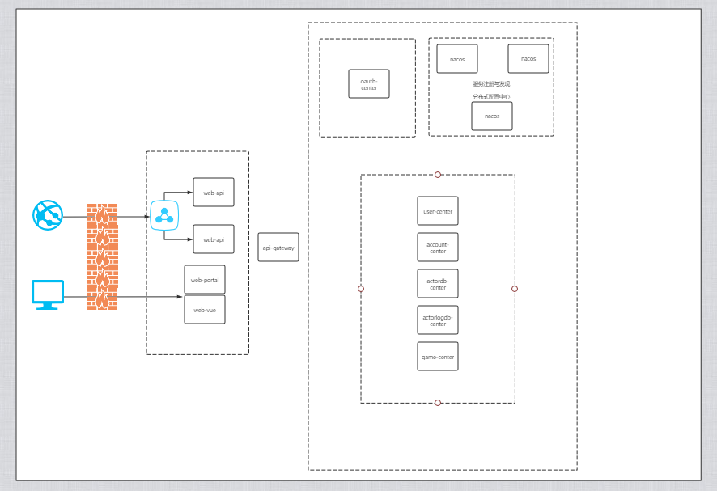

# springClound-alibaba
基于springClound-alibaba搭建的微服务项目架构
## 项目目录结构
 springClound-alibaba    
 │  
 ├─api-gateway 【网关】  
 │  
 ├─business-center 【业务类微服务】   
 │  │─account-center 【account模块】   
 │  │─actordb-center 【actordb模块】   
 │  │─actorlogdb-center 【actorlogdb模块】   
 │  │─game-center 【game模块】   
 │  └─user-center 【user模块】  
 │    
 ├─doc【文档】   
 │   
 ├─inner-intergration 【分布式基础组件】   
 │  │  
 │  └─redis-spring-boot-starter 【redis工具】  
 │     
 │─oauth-center 【oauth2 认证中心】  
 │  
 │─register-center 【nacos 注册中心】  
 │  
 │─test-untitled 【测试用例】  
 │ 
 │─web-api 【对外统一提供内部服务接口工程】  
 │ 
 │─web-portal 【后台web工程】  
 │     
 └─web-vue 【后台web工程-vue版】   
        
## 项目模块
